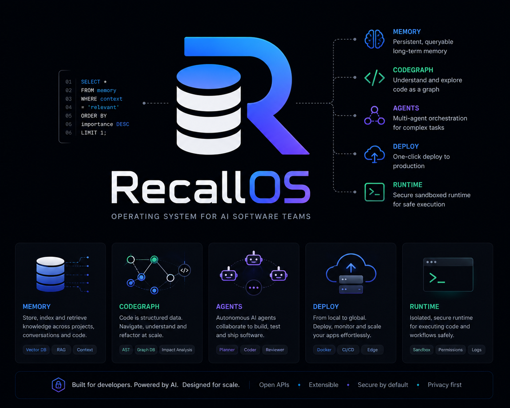

# RecallOS Runtime

Private GitHub repo: `recallos-runtime`.



RecallOS Runtime is a multi-module MCP/server tool platform for Antigravity and AI agents. Supports multi-agent workflows with identity, messaging, handoffs, and context orchestration.

## Modules

- **Knowledge Base** — SQLite + FTS5 full-text search: bugs, rules, decisions, notes.
- **CodeGraph** — Source code intelligence via MCP client: symbols, callers, context, impact.
- **Memory** — 4-layer agent memory (PostgreSQL + pgvector): events, facts, vector search, working state. Multi-agent scoped.
- **Project Brain** — Project truth: docs, modules, roadmap, decisions, glossary, conventions.
- **Context Orchestrator** — Top-level context assembly across all modules, with agent/handoff/pair context.
- **Agents** — Multi-agent identity, inter-agent messaging, and task handoff chains.

> [!IMPORTANT]
> RecallOS Runtime exposes strict module-specific MCP tools. 41 tools across 6 modules.

## Current Status

| Item | Status |
|---|---|
| Product | `RecallOS Runtime` |
| Server name | `recallos-runtime` |
| Version | `1.0.0-local` |
| MCP transport | `@modelcontextprotocol/sdk` StdioServerTransport |
| SQLite | `better-sqlite3` + FTS5, migration engine |
| PostgreSQL | `pgvector/pgvector:pg17` (Docker) |
| CodeGraph | MCP client (replaces CLI/npx) |
| Tool namespaces | `recall_kb_*`, `recall_codegraph_*`, `recall_memory_*`, `recall_project_*`, `recall_context_*`, `recall_agent_*` |
| Total tools | **41** |

## Tools

### Knowledge Base (5 tools)

| Tool | Purpose |
|---|---|
| `recall_kb_status` | DB status, FTS5, migrations, errors |
| `recall_kb_query` | Query knowledge by question/symbols/tags (FTS5) |
| `recall_kb_remember` | Store notes/rules |
| `recall_kb_decision` | Store architecture decisions |
| `recall_kb_bug` | Store bug root cause + fix |

### CodeGraph (5 tools)

| Tool | Purpose |
|---|---|
| `recall_codegraph_status` | Index stats |
| `recall_codegraph_search` | Symbol/code search |
| `recall_codegraph_context` | Code context for task |
| `recall_codegraph_symbol` | Symbol analysis |
| `recall_codegraph_impact` | Affected files/tests |

### Memory (7 tools)

| Tool | Purpose |
|---|---|
| `recall_memory_status` | PostgreSQL counts + working memory |
| `recall_memory_write_event` | Write event (auto-embed). Supports `agent_id`, `task_id`, `run_id` |
| `recall_memory_upsert_fact` | Upsert fact with expanded scopes |
| `recall_memory_search` | Hybrid search with agent/task/workspace filtering |
| `recall_memory_get_profile` | Get facts by scope + agent_id/pair_key |
| `recall_memory_summarize_session` | Summarize session → facts |
| `recall_memory_link` | Link memory items |

#### Memory Scopes

```text
global / workspace / project / agent_private / agent_pair / task / session / user / repo / agent
```

Scope columns: `workspace_id`, `project_id`, `agent_id`, `pair_key`, `task_id`, `session_id`, `run_id`

### Project Brain (9 tools)

| Tool | Purpose |
|---|---|
| `recall_project_overview` | Overview: modules, stats, current work |
| `recall_project_modules` | List modules |
| `recall_project_get_doc` | Get doc by title/type |
| `recall_project_upsert_doc` | Create/update doc (auto-version) |
| `recall_project_roadmap` | Roadmap by status/priority |
| `recall_project_add_decision` | Record decision |
| `recall_project_search` | Full-text search all Brain tables |
| `recall_project_context_pack` | **Project Truth Context** (Brain data only) |
| `recall_project_status` | Table counts |

### Agents (9 tools)

| Tool | Purpose |
|---|---|
| `recall_agent_register` | Register/update agent identity |
| `recall_agent_list` | List agents (filter by role) |
| `recall_agent_get` | Get agent details |
| `recall_agent_send_message` | Send message between agents |
| `recall_agent_get_messages` | Message history (by agent/task/run) |
| `recall_agent_get_conversation` | Conversation between 2 agents |
| `recall_agent_handoff` | Create task handoff: from → to |
| `recall_agent_handoff_update` | Update handoff status + result |
| `recall_agent_handoff_list` | List handoffs (incoming/outgoing) |

#### Agent Roles

```text
assistant / architect / secretary / coder / designer / reviewer / tester / custom
```

#### Handoff Flow

```text
Assistant → Architect → Coder → Reviewer → Assistant
```

### Context Orchestrator (6 tools)

| Tool | For | Sources |
|---|---|---|
| `recall_context_pack` | Agent chính | **Full**: Brain + Memory + KB + CodeGraph |
| `recall_context_for_task` | Specific task | **Focused**: decisions + roadmap + bugs + code |
| `recall_context_for_worker` | Sub-agent | **Minimal**: modules + conventions + rules |
| `recall_context_for_agent` | Named agent | Agent identity + private memory + messages + brain + KB + CodeGraph |
| `recall_context_for_handoff` | Receiving handoff | Handoff details + sender work + task chain + brain + KB |
| `recall_context_for_pair` | 2 agents collaborating | Both identities + conversation + pair memory + brain |

> [!TIP]
> `recall_context_pack` = recommended first call. `recall_context_for_agent` = best for multi-agent workflows.

## Module Boundaries

```text
┌──────────────────────────────────────────────────┐
│              Context Orchestrator                 │
│  context_pack / for_task / for_worker            │
│  for_agent / for_handoff / for_pair              │
├────────┬──────────┬───────┬───────────┬──────────┤
│ Project│  Memory  │  KB   │ CodeGraph │  Agents  │
│ Brain  │          │       │           │          │
│ docs   │ events   │ bugs  │ symbols   │ identity │
│ roadmap│ facts    │ rules │ callers   │ messages │
│ modules│ chunks   │ notes │ context   │ handoffs │
│ decides│ working  │       │ impact    │          │
│ glossry│          │       │           │          │
└────────┴──────────┴───────┴───────────┴──────────┘
```

| Module | Stores | When |
|---|---|---|
| **Knowledge Base** | bug/fix/rule/notes | Debug, convention, known issues |
| **Project Brain** | docs/roadmap/architecture | Project structure, planning |
| **Memory** | events/facts/vectors | Session history, agent state |
| **CodeGraph** | source code graph | Symbol search, impact |
| **Agents** | identity/messages/handoffs | Multi-agent coordination |

## Environment Variables

| Variable | Default | Purpose |
|---|---|---|
| `RECALLOS_ROOT` | package root | Runtime root |
| `RECALLOS_PROJECT_PATH` | parent of root | Target project |
| `RECALLOS_DB_PATH` | `<root>/data/recallos_runtime.sqlite` | SQLite path |
| `RECALLOS_CODEGRAPH_MCP_CMD` | `npx` | CodeGraph command |
| `RECALLOS_CODEGRAPH_TIMEOUT` | `30000` | CodeGraph timeout (ms) |
| `RECALLOS_PG_HOST` | `localhost` | PostgreSQL host |
| `RECALLOS_PG_PORT` | `5432` | PostgreSQL port |
| `RECALLOS_PG_USER` | `recallos` | PostgreSQL user |
| `RECALLOS_PG_PASSWORD` | `recallos` | PostgreSQL password |
| `RECALLOS_PG_DATABASE` | `recallos_memory` | PostgreSQL database |
| `RECALLOS_EMBEDDING_ENDPOINT` | (none) | Embedding API endpoint |
| `RECALLOS_EMBEDDING_MODEL` | `gemini/gemini-embedding-2-preview` | Embedding model |
| `RECALLOS_EMBEDDING_API_KEY` | (none) | Embedding API key |
| `RECALLOS_EMBEDDING_DIM` | `3072` | Embedding dimension |

## Quick Start

### Install

```powershell
npm install
```

### PostgreSQL (Memory + Brain + Agents)

```powershell
docker run -d --name recallos-pg -p 5432:5432 \
  -e POSTGRES_USER=recallos \
  -e POSTGRES_PASSWORD=recallos \
  -e POSTGRES_DB=recallos_memory \
  pgvector/pgvector:pg17
```

### CLI

```powershell
recall --help
recall modules
recall codegraph --help
recall kb --help
recall memory --help
recall project --help
recall context --help
```

### Test

```powershell
npm test              # MCP wiring (41 tools)
npm run test:memory   # Memory DB integration
npm run test:brain    # Project Brain DB integration
```

## Documentation

| File | Content |
|---|---|
| [architecture.md](architecture.md) | Technical architecture |
| [agent-pipeline.md](agent-pipeline.md) | Required workflow |
| [agent-policy.md](agent-policy.md) | Policy snippet |
| [user-guide.md](user-guide.md) | User guide |
| [operations.md](operations.md) | Operations |
| [roadmap.md](roadmap.md) | Roadmap |
